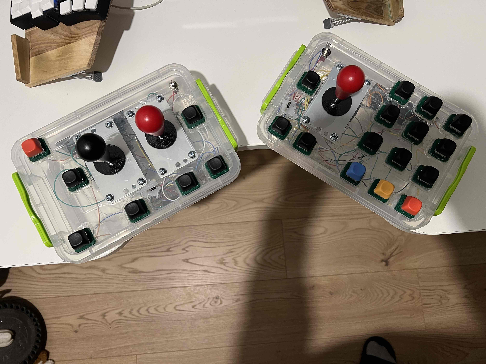

Це проєкт для незрячого бійця з ампутаціями обох кінцівок.

Відповідно до вимог, відстань між кнопками має бути більшою за звичайну, щоб можна було натиснути куксою
Оскільки ветеран незрячий, управління курсором йому непотрібне, а також пошук органів керування потрібно зменшити до мінімуму.

